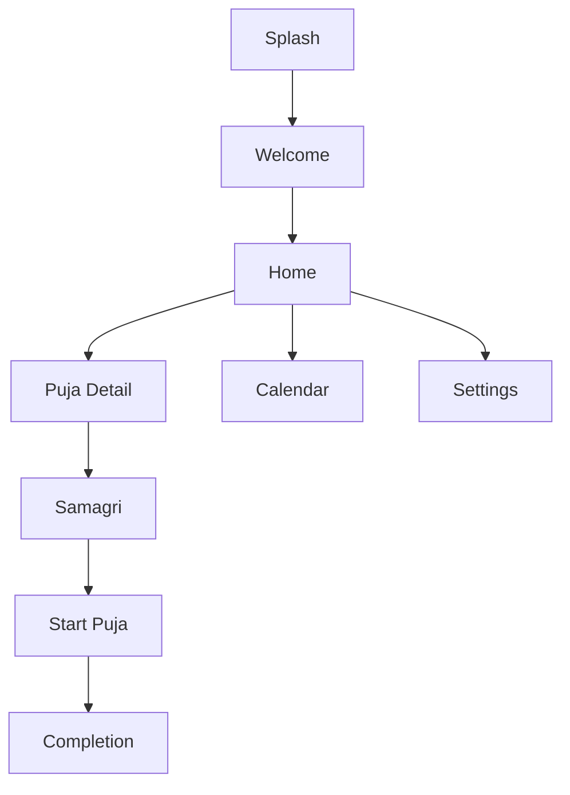

Pocket Pandit — Screen-by-screen wireframe

Overview
- Splash: logo + subtle animation
- Welcome / Onboarding: language selection, name/gotra input, opt-in reminders
- Home / Puja Dashboard: list of pujas, search, filters (daily, festival, family)
- Puja Detail: puja summary, story/katha, estimated time, difficulty, languages
- Samagri (auto-filled): checklist with explanations and links
- Start Puja: step-by-step guided view with progress bar, audio controls, images
- Completion: blessing card, share/save, add reminder
- Calendar: festival & personal reminders view

Screen Flow (simple Mermaid diagram)

Notes
- Insert user-provided name/gotra into Sankalp step.
- Provide language toggle per-screen (persist preference).
- Offline-first audio caching and progressive enhancement for animations.
